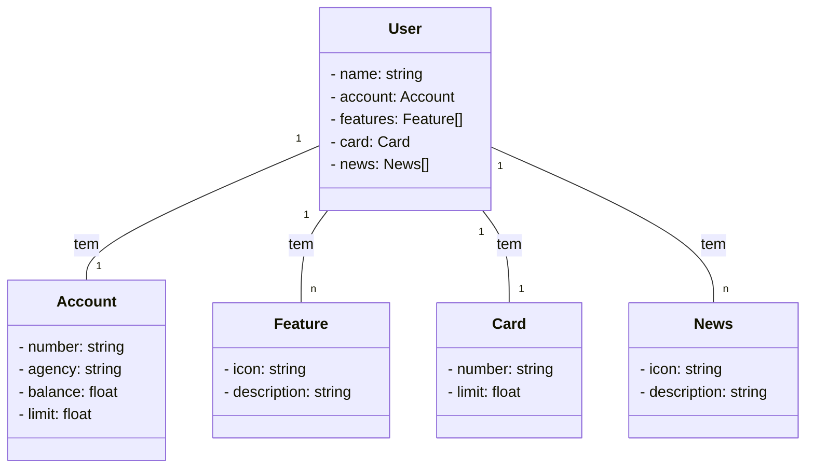

Santander Backend Java Bootcamp 2023
Projeto final do Santander Backend Bootcamp. Desenvolvimento de uma API RESTful

# Getting Started

### Documentação de Referência
Para maiores referências, favor considerar os seguintes links:

* [Official Gradle documentation](https://docs.gradle.org)
* [Spring Boot Gradle Plugin Reference Guide](https://docs.spring.io/spring-boot/docs/3.1.4/gradle-plugin/reference/html/)
* [Create an OCI image](https://docs.spring.io/spring-boot/docs/3.1.4/gradle-plugin/reference/html/#build-image)
* [Spring Web](https://docs.spring.io/spring-boot/docs/3.1.4/reference/htmlsingle/index.html#web)
* [Spring Data JPA](https://docs.spring.io/spring-boot/docs/3.1.4/reference/htmlsingle/index.html#data.sql.jpa-and-spring-data)

### Guias
Os seguintes guias ilustram como utilizar de forma concreta as features:

* [Building a RESTful Web Service](https://spring.io/guides/gs/rest-service/)
* [Serving Web Content with Spring MVC](https://spring.io/guides/gs/serving-web-content/)
* [Building REST services with Spring](https://spring.io/guides/tutorials/rest/)
* [Accessing Data with JPA](https://spring.io/guides/gs/accessing-data-jpa/)

### Link Adicional
Essa referência adicional também deve ajudar:

* [Gradle Build Scans – insights for your project's build](https://scans.gradle.com#gradle)

### Diagrama de Classe

